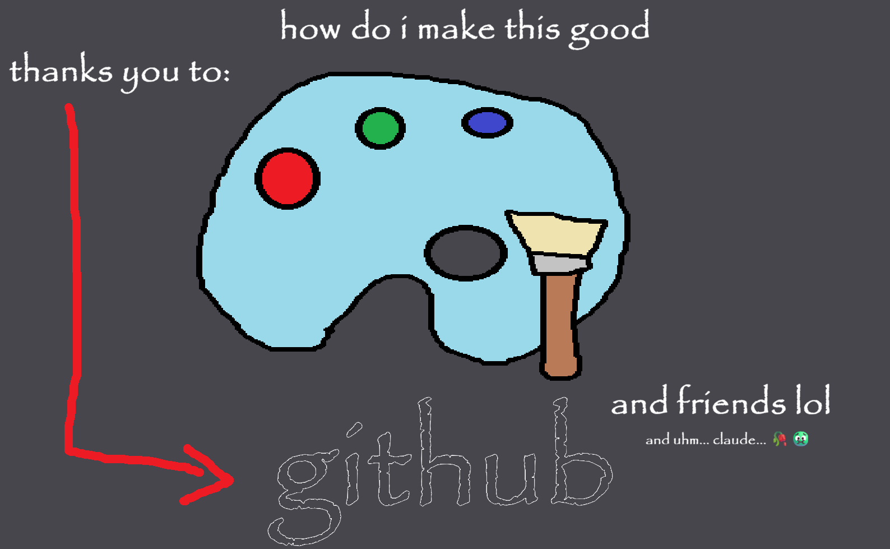

<h1 align="center"> commisionaiorme </h1>

yea i had some fun with this  

  <a href="#-tecnologias">Tecnologiess</a>&nbsp;&nbsp;&nbsp;|&nbsp;&nbsp;&nbsp;
  <a href="#-project">Projetct</a>&nbsp;&nbsp;&nbsp;|&nbsp;&nbsp;&nbsp;
  <a href="#-layout">Layout</a>&nbsp;&nbsp;&nbsp;|&nbsp;&nbsp;&nbsp;

 

  

## 🚀 Tecnologias

this project used:

- HTML and CSS
- JavaScript
- Git & Github
- passion
- sweat blood and tears

## 💻 Project

ok so this project was fun...haha...yea.hh.....haaha......

what do i put here tho like yea i guess this took a bit but like ???

## 🔖 Layout

youCANNOT look at the layout. you will NEVER see the layout!!!!!!!!!!